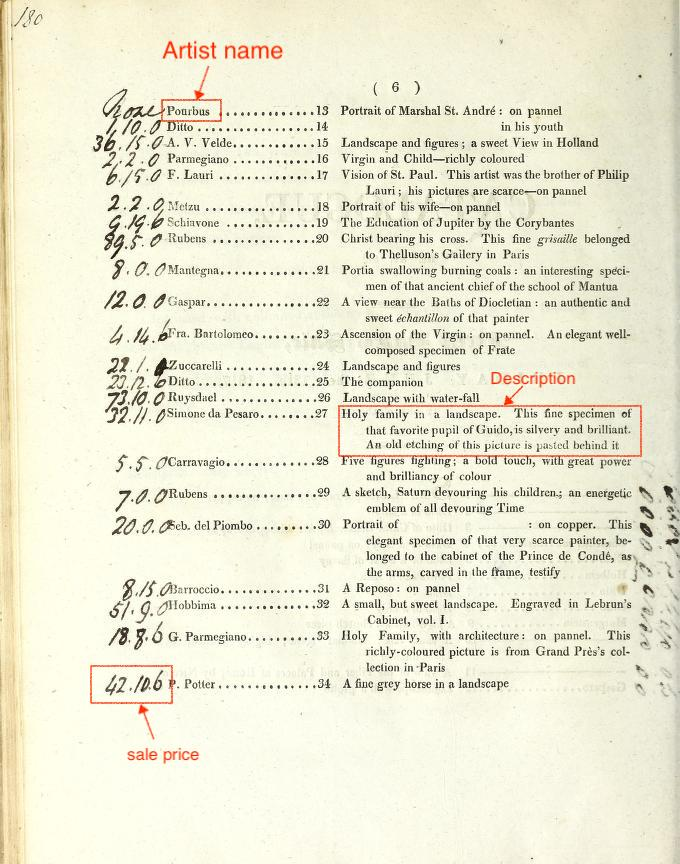

A small presentation for the [Digital Humanities Literacy Workshop](https://dsharp-cmu.github.io/DH-Literacy-Workshop-at-CMU-2019/) at Carnegie Mellon University, May 2019.

[Full PDF](tidy-dh-data.pdf)

[Example dataset](https://github.com/mdlincoln/tidy-dh-data/tree/gh-pages/example_data)

---
[Matthew D. Lincoln](https://matthewlincoln.net)
